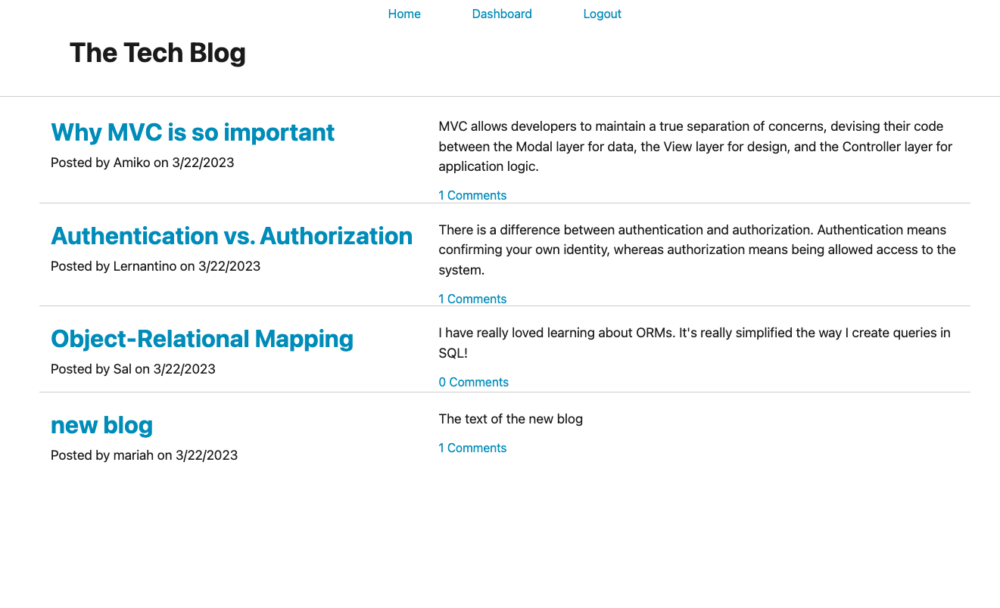

# 14 Model-View-Controller (MVC): Tech Blog
-By Mariah Wear for UC Berkeley EdX Extension

build a CMS-style blog site similar to a Wordpress site, where developers can publish their blog posts and comment on other developers’ posts as well

## Table of contents

- [Overview](#overview)
  - [The challenge](#the-challenge)
  - [Screenshot](#screenshot)
  - [Links](#links)
- [My process](#my-process)
  - [Built with](#built-with)
  - [What I learned](#what-i-learned)
  - [Continued development](#continued-development)
- [Author](#author)
- [Acknowledgments](#acknowledgments)

## Overview

### The challenge

Users should be able to:

-Publish their blog posts and comment on other developers’ posts as well. 
-The app will follow the MVC paradigm in its architectural structure, using Handlebars.js as the templating language, Sequelize as the ORM, and the express-session npm package for authentication.

## User Story (given from source)

```md
AS A developer who writes about tech
I WANT a CMS-style blog site
SO THAT I can publish articles, blog posts, and my thoughts and opinions
```

## Acceptance Criteria (given from source)

```md
GIVEN a CMS-style blog site
WHEN I visit the site for the first time
THEN I am presented with the homepage, which includes existing blog posts if any have been posted; navigation links for the homepage and the dashboard; and the option to log in
WHEN I click on the homepage option
THEN I am taken to the homepage
WHEN I click on any other links in the navigation
THEN I am prompted to either sign up or sign in
WHEN I choose to sign up
THEN I am prompted to create a username and password
WHEN I click on the sign-up button
THEN my user credentials are saved and I am logged into the site
WHEN I revisit the site at a later time and choose to sign in
THEN I am prompted to enter my username and password
WHEN I am signed in to the site
THEN I see navigation links for the homepage, the dashboard, and the option to log out
WHEN I click on the homepage option in the navigation
THEN I am taken to the homepage and presented with existing blog posts that include the post title and the date created
WHEN I click on an existing blog post
THEN I am presented with the post title, contents, post creator’s username, and date created for that post and have the option to leave a comment
WHEN I enter a comment and click on the submit button while signed in
THEN the comment is saved and the post is updated to display the comment, the comment creator’s username, and the date created
WHEN I click on the dashboard option in the navigation
THEN I am taken to the dashboard and presented with any blog posts I have already created and the option to add a new blog post
WHEN I click on the button to add a new blog post
THEN I am prompted to enter both a title and contents for my blog post
WHEN I click on the button to create a new blog post
THEN the title and contents of my post are saved and I am taken back to an updated dashboard with my new blog post
WHEN I click on one of my existing posts in the dashboard
THEN I am able to delete or update my post and taken back to an updated dashboard
WHEN I click on the logout option in the navigation
THEN I am signed out of the site
WHEN I am idle on the site for more than a set time
THEN I am able to view comments but I am prompted to log in again before I can add, update, or delete comments
```

### Screenshot



### Links

- Live Site URL: [Heroku Link](https://tech-blog-application.herokuapp.com/home)
- Solution URL: [Github Repo](https://github.com/mariahw4/14-Tech-Blog)

## My process

### Built with

- Semantic HTML5 markup
- CSS custom properties
- JASS stylesheet
- JavaScript
- Handlebars
- Database
- MVC structure
- [express-handlebars](https://www.npmjs.com/package/express-handlebars)
- [MySQL2](https://www.npmjs.com/package/mysql2)
- [Sequelize](https://www.npmjs.com/package/sequelize) 
- [dotenv package](https://www.npmjs.com/package/dotenv) 
- [bcrypt package](https://www.npmjs.com/package/bcrypt)
- [express-session](https://www.npmjs.com/package/express-session) 
- [connect-session-sequelize](https://www.npmjs.com/package/connect-session-sequelize)

**Note**: The [express-session](https://www.npmjs.com/package/express-session) package stores the session data on the client in a cookie. When you are idle on the site for more than a set time, the cookie will expire and you will be required to log in again to start a new session. This is the default behavior and you do not have to do anything to your application other than implement the npm package.


### What I learned

This project expanded my knowledge of full stack development using the MVC framework.  

I am very proud of myself for figuring out the routes and how they interact with both the front end and the database on the back end.  

### Continued development

In order to continue development on this project I would ensure that only the person who writes a comment is able to delete the comment rather than any logged in user being able to delete any comment.  

I would also allow for comments and blog posts both to be updated by the author.


## Author

- Website - [Mariah Wear - Git hub Profile](https://github.com/mariahw4)
- LinkedIn - [Profile](https://www.linkedin.com/in/mariah-wear-7b1630255/)


## Acknowledgments

I would like to give thanks to the TA's at the UC Berkeley Full Stack Web Dev and Coding bootcamp! They were amazing at troubleshooting my problem!


